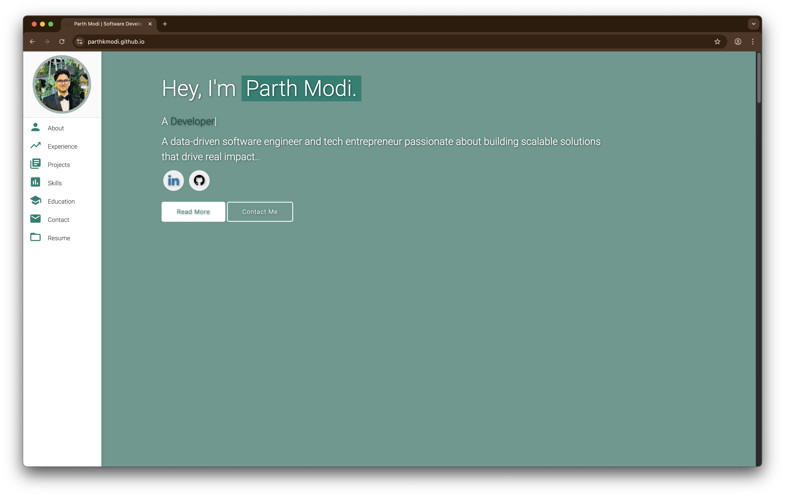
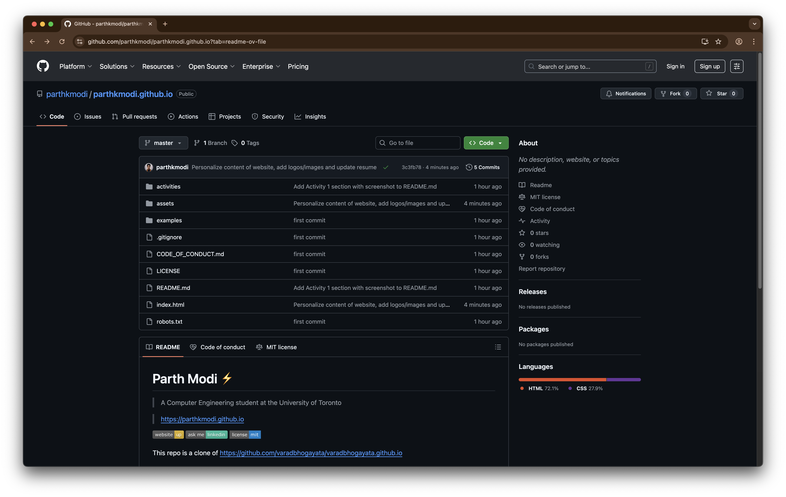

# Parth Modi ⚡️ 
> A Computer Engineering student at the University of Toronto

> https://parthkmodi.github.io

This repo is a clone of https://github.com/varadbhogayata/varadbhogayata.github.io

### Activity 1

### Activity 2

